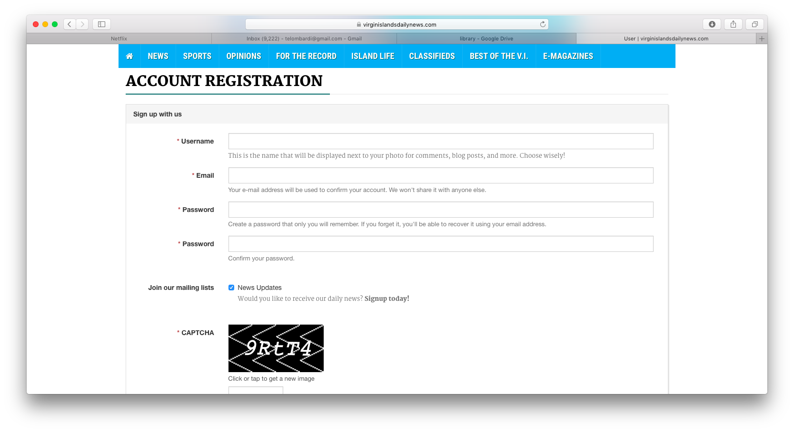

#Introduction to Business Information Systems

Information systems are used in almost every aspect of personal and professional life. You are probably already familiar with information systems for personal uses such as music and movie streaming services. While this course may touch on some of these topics, this course focuses on how businesses use information systems to improve their ability to provide goods and services to customers. 

"An __information system__ is a set of hardware, software, data, people and procedures that work together to produce information" (Vermaat et al., 2016, p. 554). 

Watch the following short video (less than 3 minutes) to learn more 
about information systems:

```{r echo=FALSE}
library(htmltools)
library(vembedr)
embed_youtube(id = "Qujsd4vkqFI")
```

__Source__: What is an information system? <https://www.youtube.com/watch?v=Qujsd4vkqFI>

#Data, Metadata and Information

Information systems transform data into information. Understanding the difference between data and information is crucial to understanding information systems.

"__Data__ is a raw fact and can take the form of a number or statement such as a date or a measurement" (Hardcastle, 2008, p. 6).

Businesses develop procedures for collecting and processing data at a variety of levels of detail.

__Metadata__ is a description of data. When you fill out an online form, the field names in the form such as Username and Password are examples of metadata. For example, consider the online form for The Virgin Island Daily News website:



The field names provide context for users helping them to input appropriate data into the form.

Even this simple form defines a process for collecting data so that it can be transformed into information. The CAPTCHA ( __C__ ompletely __A__ utomated __P__ ublic __T__ uring test to tell __C__ omputers and __H__ umans __A__ part) ensures that the user filling out the form is in fact a person rather than a bot. In other words, the website is designed to check the quality of the data being input to ensure that each record represents a real user. Quality data is much easier to transform into useful information.

Although there are many definitions of information (Floridi, 2005), for the purposes of this class, __information__ is processed data that is meaningful to a particular audience in a particular context.

It is important to recognize that data and information serve an important role in the construction of knowledge and wisdom (Rowley, 2007). 

#Properties of Information

In order for information to be meaningful, it must possess several properties (Vermaat et al., 2016, p. 554):

+ Accurate

+ Verifiable

+ Timely

+ Organized

+ Accessible

+ Useful

+ Cost-effective

#Examples of Information Systems

A __Enterprise Resource Planning (ERP)__ integrates manufacturing resource planning with the information flow across an organization to manage and coordinate the ongoing activities of the enterprise, including product planning, manufacturing and distribution, accounting and finance, sales, human resources, and customer support (Vermaat et al., 2016, p. 555).

A __Document Management System (DMS)__ allows for storage and management of a company's documents, such as word processing documents, presentations and spreadsheets (Vermaat et al., 2016, p. 556).

A __Content Management System (CMS)__ enables and manages the publishing, modification, organization, and access of various forms of documents, including media and webpages (Vermaat et al., 2016, p. 557).

A __Transaction Processing System (TPS)__ captures and processes data from day-to-day business activities such as credit card transactions (Vermaat et al., 2016, p. 557).

A __Management Information System (MIS)__ generates accurate, timely, and organized information supporting managers in their mission critical tasks such as decision-making, problem-solving, supervising and tracking progress (Vermaat et al., 2016, p. 558).

A __Decision Support System (DSS)__ helps users analyze information and make decisions. DSS are sometimes called online analytical processing (OLAP) programs (Vermaat et al., 2016, p. 559).

An __Expert System__ captures and stores the knowledge of human experts and then imitates human
reasoning and decision-making (Vermaat et al., 2016, p. 560).

For more information about the kinds of information systems commonly in use, watch the following video (roughly 5 minutes).

```{r echo=FALSE}
embed_youtube(id = "iX_SQfIDxtE")
```

__Source__: Types of Information Systems. <https://www.youtube.com/watch?v=iX_SQfIDxtE>

[Classroom Exercise: Find an example of a specific type of information system.]

#Components of Information Systems

Watch the following video (about 10 minutes) to learn about the five components of information systems that we will learn about this semester.

```{r echo=FALSE}
embed_youtube(id = "XlcolUHMnh0")
```

__Source__: The 5 Components of an Information System. <https://www.youtube.com/watch?v=XlcolUHMnh0>

+ Hardware

+ Software

+ Data

+ People

+ Processes

#Examples of Careers in Technology

[Classroom exercise: Find an example of a career in technology that you find compelling.]

#Sources

Floridi, L. (2005). Is Information Meaningful Data? _Philosophy and Phenomenological Research_, 70 (2), pp. 351-370.
http://philsci-archive.pitt.edu/2536/1/iimd.pdf

Hardcastle, E. (2008). Business Information Systems. Ventus Publishing ApS. http://paginas.fe.up.pt/~apm/ESIN/docs/bis.pdf

Madrigal, A. (2014, April 15). CAPTCHAs Are Becoming Security Theater.
_The Atlantic_.
http://www.theatlantic.com/technology/archive/2014/04/captchas-are-becoming-security-theater/360786/

Rowley, J. (2007). The wisdom hierarchy: representations of the DIKW hierarchy. Journal of Information and Communication Science, 33 (2), pp. 163-180. 

Vermaat et al. (2016). _Discovering Computers 2016_. Shelly Cashman.
