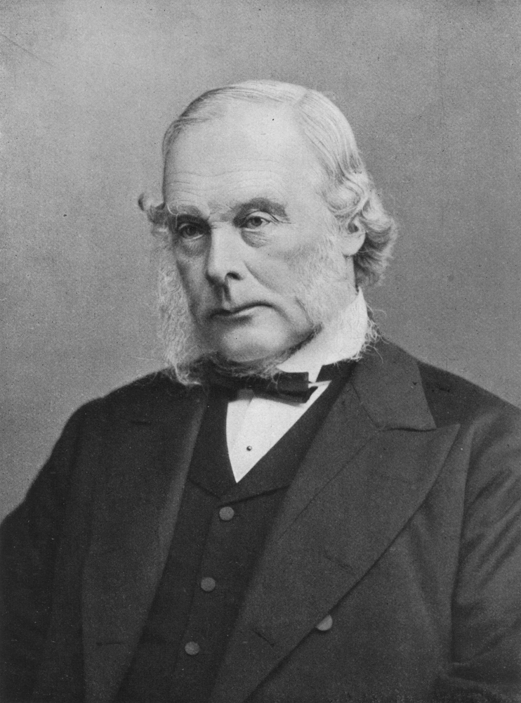
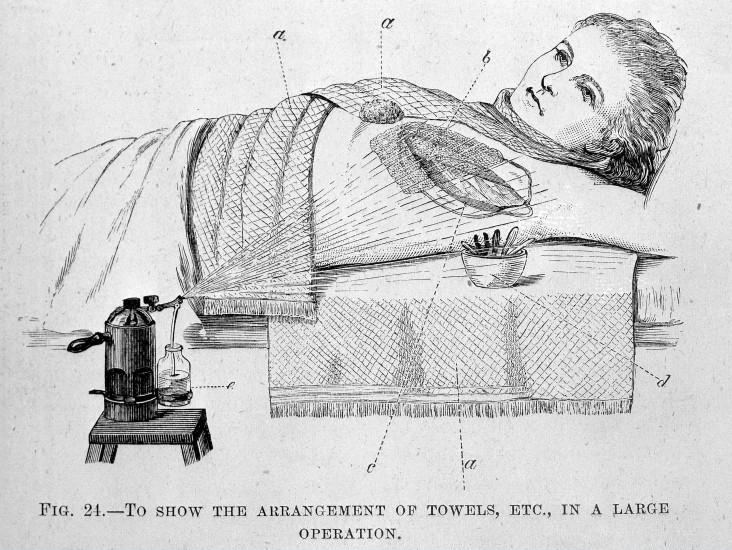

```{r echo=FALSE}
library(tufte)
```

#Introduction

```{r echo=FALSE, fig.margin=TRUE, fig.cap="Joseph Lister"}

```

Joseph Lister (1827 - 1912) was a surgeon and professor of clinical surgery. 
He is widely credited for the development and application of antiseptic 
techniques in surgery (Tröhler, 2014; Pitt & Aubin, 2012). As a surgeon at the Glasgow Royal Infirmary in the 1860s, Lister tested the effectiveness of using carbolic acid
to protect wounds from infection. This case study reviews his medical innovations and
his use of statistical methods to prove the effectiveness of his technique to 
his peers. After this review, the case study demonstrates how statistical 
techniques developed after his work can be applied to strengthen his case.
Finally, the case study discusses the challenges of scientific progress in 
clinical settings.

#Standard Medical Practice and Lister's Innovation

When Lister was appointed to the Glasgow Royal Infirmary, the state of 
knowledge regarding common infections to wounds was drastically different 
from our understanding today. 
Pitt and Aubin (2012) in their commemoration of Lister's accomplishments summarized 
the state of knowledge directly: 
"The world of surgery when Lister began his practice was primitive by our standards. Although 
Fracastoro of Verona in 1546 theorized that small germs could cause contagious diseases, no 
one associated them with wound infections" (Pitt & Aubin, 2012). Since common 
infections in wounds were not properly connected to germ theory, medical practices 
at the time contributed to the problem in several ways (Pitt & Aubin, 2012). 

* Linens, laboratory coats and surgical instruments were not sterilized.

* Probes used to inspect wounds were used on multiple patients without cleaning.

* The discharging of pus, suppuration, was considered a normal part of the 
healing process.

When Lister began his work, he dressed wounds for the future President of the
Royal College of Surgeons, Sir J. E. Erichsen. Erichsen believed that the 
infections commonly associated with wounds were spread via the air. Lister's
experience with the practical aspects of dressing wounds led him to doubt 
this explanation because some wounds healed after the removal of contaminated
tissue and cleansing. Lister came to believe that the problem originated in the 
wound itself (Pitt & Aubin, 2012).

At the advice of a professor of chemistry, Thomas Anderson, Lister 
read Pasteur's paper about the process of decay in organic matter and 
hypothesized that a process similar to fermentation operated in the case
of wound sepsis (Pitt & Aubin, 2012). At the time, creosote, an oil distilled from coal tar, was 
already being used to disinfect sewage. Lister started to apply carbolic 
acid as an antiseptic to surgical wounds. Over time, he developed new 
delivery mechanisms for his treatments like that displayed in Figure 2.

```{r echo=FALSE, fig.margin=TRUE, fig.cap="Lister's technique"}

```

As a clinician, Lister became convinced that his technique worked 
effectively and saved lives, but he had difficulty proving this to 
his contemporaries.

#Lister's Analysis 

For the most part, Lister relied on case reports for his analysis.
For example, he cited counts of deaths before his use of antiseptics and 
compared them to counts of deaths during the period in which he used 
his antiseptic treatments. For example, Lister writes that: "Comparing the aggregate results, we have-- Before the antiseptic period, 16 deaths in 35 cases; or 1 death in every 2 1/5 cases.
During the antiseptic period, 6 deaths in 40 cases; or 1 death in every 6 2/3 cases."
(Lister, 1870).

Lister and his contemporaries recognized that the small number of cases 
cited could be explained by random variation: "These numbers are, no doubt, too small for a satisfactory statistical comparison; but, when the details are considered, they are highly valuable with reference to the question we are considering." (Lister, 1870). 

`r margin_note("Pyaemia is blood poisoning caused by bacteria in the bloodstream.")`

Lister's response was to examine critically the cases before him. In a
continuation of the previous passage, Lister drills down deeply into 
a special set of cases in his practice: amputations. "This is especially the case with
amputation in the upper limb, where neither injuries requiring primary amputation 
nor the operations involve, as a general rule, much loss of blood or shock
to the system; so that, if death does occur, it is commonly the result of the
wound assuming unhealthy characters. It happens that there were 12 amputations
altogether in the upper limb in each of the two periods referred to. Of
the 12 cases before the antiseptic period, no fewer than 6 died -- a frightful
mortality certainly. And it is recorded that, of those 6, 4 died of pyaemia
and 1 of hospital gangrene." (Lister, 1870).

Based on his observations, Lister began to apply his technique to those 
with compound fractures because if the treatment failed, 
then he could fall back on amputation
to help the patient. As a clinician, Lister considered the health of 
his patients as paramount in his decision making. 

A contemporary of Lister's, Lawson Tait, on the other hand, suggested that the effectivenss of the 
treatment could only be known in the context of what we call today a
controlled experiment (Tröhler, 2014). Overall, we can see that the 
medical community of Lister's time was struggling to establish reliable 
principles for selecting treatments. Both approaches recognized the 
need for better comparative statistics for medical research.

"Despite the understanding of the kind of evidence needed - comparative statistics of at least two parallel groups in comparable conditions, and the ways to obtain these - nothing of the kind was done, except, maybe, by Tait himself. But his large scale experiments were published only in abstract form. There were comparisons, but they were with historical controls. These were criticisable - and criticised - because hospital hygiene had been much improved, and operative technique had changed concurrently with the introduction of the everchanging Listerian antiseptic regimens. It was therefore impossible to sort out the extent to which each of these was responsible for the observed decrease in operative mortality." (Tröhler, 2014).

These researchers struggled because their studies were conducted before 
Karl Pearson constructed the kind of statistical test that could differentiate
random variation from true effects in count data: chi-squared test of independence. 

#Extending Lister's Analysis with Statistics

We can use Pearson's chi-squared test of independence to see if Lister's
data hold up to statistical scrutiny. We can create a 2x2 contingency 
table with Lister's counts.

```{r echo=FALSE}
df <- as.data.frame(matrix(c(16.0,6.0,19.0,34.0), nrow=2, ncol=2, byrow=TRUE),
      row.names=c("Died", "Survived"))
colnames(df) <- c("Before_Treatment","During_Treatment")
```

```{r echo=FALSE}
knitr::kable(
  df, caption = "Lister's Aggregated Data"
)
```

In R, we perform the test with the following command.
Remember that the null hypothesis is that there is no relationship 
between Lister's treatment and his patients' survival.
By convention, we set our alpha value to 0.05. In other words, 
if our p-value is below 0.05, then we will reject the null hypothesis.
In that case, we can conclude that we have evidence supporting the 
hypothesis that Lister's method affected his patients' survival significantly.

```{r}
chisq.test(as.matrix(df), correct=FALSE)
```

Most students are familiar with the chi-squared test, but there are 
other tests for this kind of data. We can perform the same 
statistical test with Fisher's Exact Test. Both tests suggest that 
Lister's evidence supports his claim.

```{r}
fisher.test(as.matrix(df), conf.level=0.95)
```

#Challenges to the Scientific Method in Clinical Settings

Lister's data recorded a true effect: there is a significant difference 
between the two groups. Can we be sure that Lister's treatment 
explains this real difference?
Although Lister's data does appear to support his claims, the statistical 
tests do not correct for the fact that his data was not collected in 
a controlled experiment. For example, Lister is comparing data collected
in clinical settings in 
two different time periods
meaning that many other variables changed between the two collection
periods. In other words, without strict controls, we cannot be sure that
the real differences between the two periods were due to Lister's innovation.

On the other hand, there are ethical problems with applying the 
scientific method in clinical settings. If a Doctor believes that a treatment
provides a better care option, then it would be unethical to withold this 
treatment from some patients for the purposes of science. In many 
contexts including clinical practice, the scientific method is not 
a practical or ethical option. As powerful as the scientific method is, 
we can learn quite a lot from close observation and clear thought. The next time you use mouthwash (Listerine) or receive any other type of 
antiseptic, remember that Lister made his great contribution without the benefits of advanced statistics or the scientific method.

#References

Lister, J. (1870). Effects of the antiseptic system of treatment upon the 
salubrity of a surgical hospital. _Lancet_ 1:4-6, 40-42.
(http://www.jameslindlibrary.org/lister-j-1870/)

Pitt, D., & Aubin, J.-M. (2012). Joseph Lister: father of modern surgery.
_Canadian Journal of Surgery_, 55(5), E8-E9. http://doi.org/10.1503/cjs.007112
(https://www.ncbi.nlm.nih.gov/pmc/articles/PMC3468637/)

Tröhler, U. (2014). Statistics and the British controversy about the effects of 
Joseph Lister's system of antisepsis for surgery, 1867-1890.
_JLL Bulletin: Commentaries on the history of treatment evaluation_ 
(http://bit.ly/2bYH94K)

Wellcome Collection. (n.d.). The Hospital: Glasgow, 1867.
(https://wellcomecollection.org/hospital-glasgow-1867/)

#Session Information

```{r}
sessionInfo()
```
