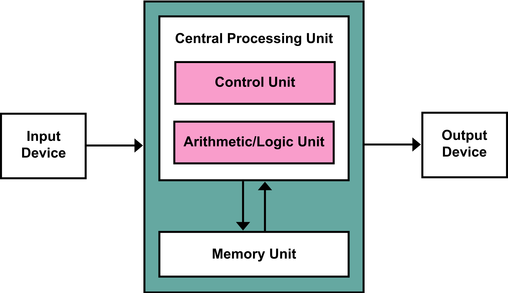
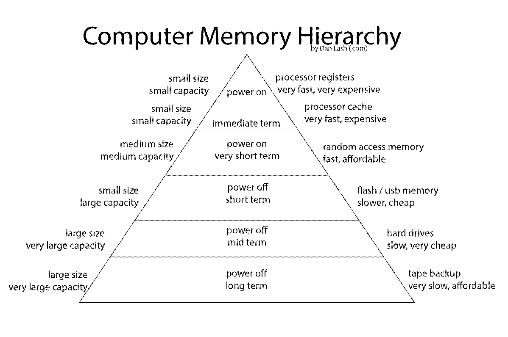

#Foundations of Computer Hardware

The word __computer__ has a long, complicated history. In the Nineteenth and early Twentieth Century, the word computer referred to a person's occupation. If a person was referred to as a "computer", then that person performed calculations to earn a living (Campbell-Kelly et al., 2014, p. 3). For a variety of reasons, after WWII, the word "computer" referred to machines that performed calculations rather than people with a specific occupation.

In this class, we will use the following definition for the term computer: "A __computer__ is an electronic device, operating under the control of instructions stored in its own memory, that can accept data (input), process the data according to specified rules, produce information (output), and store information for future use. Computers contain many electric, electronic, and mechanical components known as hardware" (Vermaat et al., 2015, p. 4).

Most modern computers in common use rely on a logical organization of components referred to as "the stored program concept". In particular, most modern computers consistently organize computer hardware into similar categories that have proven useful despite rapid changes in technology.

#Stored Program Concept and the von Neumann Architecture: The Computer Organized by Functional Components

According to Campbell-Kelly et al. (2014), the stored program concept organizes the work of a computer so that "the computer's storage device [memory] would be used to hold both the instructions of a program and the numbers on which it operated" (p. 76). In other words, from the point of view of a computer, the instructions (program) are just another type of data to process in memory. 

The particular type of stored-program computer most commonly used today is based on the von Neumann architecture (Figure 1). 




Figure 1: The von Neumann Architecture. Credit: By Kapooht - Own work, CC BY-SA 3.0,
<https://commons.wikimedia.org/w/index.php?curid=25789639>
 
The von Neumann Architecture, as it is often referred to today, has given three important characteristics to contemporary computing:

1. A __useful taxonomy__ of computer components based on their function;
2. A set of constraints limiting the efficiency of computation (von Neumann Bottleneck);
3. A set of security problems based on the use of memory for both instructions and data.

For now, we will focus on item 1, the useful taxonomy of computer components based on function, although we will discuss points 2 and 3 later in the semester.

The von Neumann architecture breaks a computer into 5 basic functional components that we still recognize today. In fact, much of the organization of chapter 1 reflects this organization of computer components. We will discuss these concepts in more depth when we review chapters 6-8 in our textbook. For now, we will discuss these logical components in general. 

* Central Processing Unit (CPU)

     + Control Unit
     
     + Arithmetic/Logic Unit

* Memory Unit

* Input Device

* Output Device

##Processors

"The processor, also called the __central processing unit (CPU)__, interprets and carries out the basic instructions that operate a computer" (Vermaat et al., 2015, p. 280).

"The __control unit__ is the component of the processor that directs and coordinates most of the operations in the computer. That is, it interprets each instruction issued by a program or an application and then initiates the appropriate action to carry out the instruction" (Vermaat et al., 2015, p. 281).

"The __arithmetic logic unit (ALU)__, another component of the processor, performs arithmetic, comparison, and other operations" (Vermaat et al., 2015, p. 281). For example, the ALU performs basic arithmetic operations like addition and subtraction as well as logical operations such as determining if two values are equal. 

##Memory (and other Storage Devices)

" __Memory__ consists of electronic components that store instructions waiting to be executed and the data needed by those instructions" (Vermaat et al., 2015, p. 16).

"A __storage device__ records (writes) and/or retrieves (reads) items to and from storage media" (Vermaat et al., 2016, p. 17). 

##Input Devices

"An __input device__ is any hardware component that allows you to enter data and instructions into a computer or mobile device" (Vermaat et al., 2016, p. 12).

##Output Devices

"An __output device__ is any hardware component that conveys information from a computer or mobile device to one or more people" (Vermaat et al., 2016, p. 14).

#Memory Hierarchy: The Computer Organized by Component Efficiency 

When the stored-program concept was first developed (before WWII), the distinction between memory and storage had little meaning because most computers had exceptionally little memory or storage compared to contemporary computers. Since that time, technical advances have created many layers of memory and storage referred to as a __memory hierarchy__ (Figure 2). 

At the peak of the memory hierarchy are the fastest, most expensive components with the smallest capacity. For example, the __registers__ inside modern processors are very fast, very expensive and hold only a small amount of data. Closer to the bottom of the memory hierarchy are __hard disk drives__ which are relatively slow and inexpensive, but hold much more data than components higher up in the memory hierarchy. 



Figure 2: The Memory Hierarchy. __Source__ : <https://commons.wikimedia.org/wiki/File:ComputerMemoryHierarchy.svg>

#Binary Digits and Encoding

Most computers do not naturally operate on numbers and letters the way we do. Instead, modern computers manipulate __bi__ nary dig __its__ (or bits) and then translate these bits into the number and letter systems more familiar to us. In order for us to understand business information systems, we have to become familiar and comfortable with this process.

A __bit__ (binary digit) stores a 0 or a 1.

A __byte__ is 8 bits.

##Converting between base-10 and base-2 numbers

The number 255 in base-10 stands would be written as follows in base-2 numbers:
11111111

The base-2 number (00001000) is the equivalent of 8 in base-10 numbers.

Watch the following detailed explanations for more information.

```{r echo=FALSE}
library(htmltools)
library(vembedr)
embed_youtube(id = "qdFmSlFojIw")
```

__Source__ : <https://www.youtube.com/watch?v=qdFmSlFojIw>

```{r echo=FALSE}
embed_youtube(id = "kcTwu6TFZ08")
```

__Source__ : <https://www.youtube.com/watch?v=kcTwu6TFZ08>

To read more about binary numbers, read the following website:
<http://www.mathsisfun.com/binary-number-system.html>

##Encoding

How does the computer take binary numbers (base-2) and translate them into the symbols we need to express text, numbers and other types of data?

Computers use tables of symbols to translate between binary numbers and the characters that we use in our languages and number systems. 

The __American Standard Code for Information Interchange (ASCII)__ defines common symbols and the binary codes that represent them (Figure 3).


Figure 3: US ASCII Code Chart. __Source__: <https://commons.wikimedia.org/wiki/File:US-ASCII_code_chart.png>

For example, the letter 'A' is represented by the bits 
100 0001 (the decimal number 65).

Every computer uses a __code page__ similar to that in the ASCII Code Chart to translate binary codes to common characters.

Selecting an appropriate code page is an important part of configuring a computer for a user because different users require different encodings to render the symbols in their language properly.

Use the `chcp` command to identify the code page operating on your windows machine.

```
chcp
```

_What code page are we using on the lab computers?_

#Computer Hardware and User Needs

Many textbooks divide users into categories similar to those outlined in our textbook (Vermaat et al., 2015, pp. 41 - 42). Although these types of categories can be helpful to gain a broad understanding of user needs, most users have even more specific types of needs than those outlined by such organizational schemes. 

In a professional context, we often need to adapt computers to the needs of users based on user goals and abilities. 

#Resources

Campbell-Kelly, M., Aspray, W., Ensmenger, N., & Yost, J. R. (2014). _Computer: a history of the information machine_. Boulder, CO: Westview Press, A Member of the Perseus Books Group.

Vermaat, M., Sebok, S. L., Freund, S. M., Campbell, J. T., & Frydenberg, M. (2015). Discovering computers 2016: tools, apps, devices, and the impact of technology. Boston, MA: Cengage learning.


