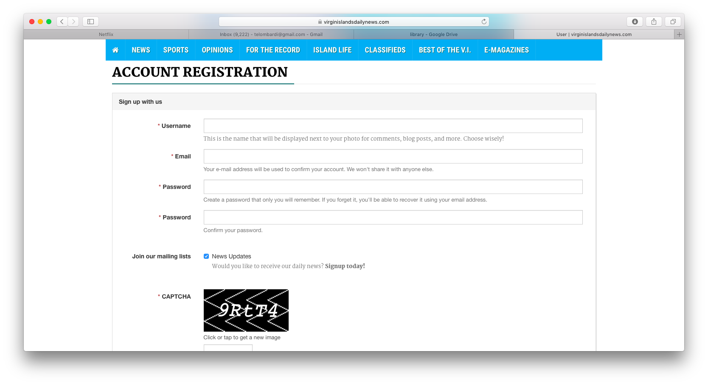

#Introduction to Information Systems

Information systems are used in almost every aspect of personal and professional life. You are probably already familiar with information systems for personal uses such as music and movie streaming services. While this course may touch on some of these topics, this course focuses on how businesses use information systems to improve their ability to provide goods and services to customers. 

"An __information system__ is a set of hardware, software, data, people and procedures that work together to produce information" (Vermaat et al., 2016, p. 554). 

Watch the following short video (less than 3 minutes) to learn more 
about information systems.

```{r echo=FALSE}
library(htmltools)
library(vembedr)
embed_youtube(id = "Qujsd4vkqFI")
```

__Source__: What is an information system? <https://www.youtube.com/watch?v=Qujsd4vkqFI>

#Data, Metadata and Information

Information systems transform data into information. Understanding the difference between data and information is crucial to understanding information systems.

"__Data__ is a raw fact and can take the form of a number or statement such as a date or a measurement" (Hardcastle, 2008, p. 6).

Businesses develop procedures for collecting and processing data at a variety of levels of detail.

__Metadata__ is a description of data. When you fill out an online form, the field names in the form such as Username and Password are examples of metadata. For example, consider the online form for The Virgin Island Daily News website:



The field names provide context for users helping them to input appropriate data into the form.

Even this simple form defines a process for collecting data so that it can be transformed into information. The CAPTCHA (Completely Automated Public Turing test to tell Computers and Humans Apart) ensures that the user filling out the form is in fact a person rather than a bot. In other words, the website is designed to check the quality of the data being input to ensure that each record represents a real user. Quality data is much easier to transform into useful information.

Although there are many definitions of information (Floridi, 2005), for the purposes of this class, __information__ is processed data that is meaningful to a particular audience in a particular context.

It is important to recognize that data and information serve an important role in the construction of knowledge and wisdom (Rowley, 2007). 

#Properties of Information

In order for information to be meaningful, it must possess several properties (Vermaat et al., 2016, p. 554):

+ Accurate

+ Verifiable

+ Timely

+ Organized

+ Accessible

+ Useful

+ Cost-effective

#Examples of Information Systems

A __Enterprise Resource Planning (ERP)__ integrates manufacturing resource planning with the information flow across an organization to manage and coordinate the ongoing activities of the enterprise, including product planning, manufacturing and distribution, accounting and finance, sales, human resources, and customer support (Vermaat et al., 2016, p. 555).

A __Document Management System (DMS)__ allows for storage and management of a company's documents, such as word processing documents, presentations and spreadsheets (Vermaat et al., 2016, p. 556).

A __Content Management System (CMS)__ enables and manages the publishing, modification, organization, and access of various forms of documents, including media and webpages (Vermaat et al., 2016, p. 557).

A __Transaction Processing System (TPS)__ captures and processes data from day-to-day business activities such as credit card transactions (Vermaat et al., 2016, p. 557).

A __Management Information System (MIS)__ generates accurate, timely, and organized information supporting managers in their mission critical tasks such as decision-making, problem-solving, supervising and tracking progress (Vermaat et al., 2016, p. 558).

A __Decision Support System (DSS)__ helps users analyze information and make decisions. DSS are sometimes called online analytical processing (OLAP) programs (Vermaat et al., 2016, p. 559).

An __Expert System__ captures and stores the knowledge of human experts and then imitates human
reasoning and decision-making (Vermaat et al., 2016, p. 560).

For more information about the kinds of information systems commonly in use, watch the following video (roughly 5 minutes).

```{r echo=FALSE}
embed_youtube(id = "iX_SQfIDxtE")
```

__Source__: Types of Information Systems. <https://www.youtube.com/watch?v=iX_SQfIDxtE>

[Classroom Exercise: Find a specific example of a type of information system discussed above.]

#Components of Information Systems

Watch the following video (about 10 minutes) to learn about the five components of information systems that we will learn about this semester.

```{r echo=FALSE}
embed_youtube(id = "XlcolUHMnh0")
```

__Source__: The 5 Components of an Information System. <https://www.youtube.com/watch?v=XlcolUHMnh0>

+ Hardware

+ Software

+ Data

+ People

+ Process (Procedures)

#User Perspectives on Information

The primary goal of this class is to help you understand a business from the perspective of and in terms of information systems. Since information systems ideally respond to the needs of specific business users, it helps to have a sense of who these users are and what they want to accomplish (Shelly & Rosenblatt, 2012, pp. 18-19).

__Top Managers__ are responsible for the long-term, strategic planning in an enterprise. Top managers need information about company-wide trends to help them make decisions. They might ask questions such as "Should the company try to expand its number of stores in North America?" In order to answer such questions and make such decisions, top managers need high-level information from the company's information systems as well as information from external sources.

__Middle Managers and Knowledge Workers__ work just below the top managers in an organization to provide direction to supervisors and team leaders. Middle managers do not generally tackle the large questions of the top manager, but rather focus on shorter-term goals and objectives. For example, middle managers might review quarterly sales reports to support team leaders and operational employees in a specific region. Knowledge workers are professional specialists like systems analysts and programmers who provide support for an organization's basic functions.

__Supervisors and Team Leaders__ manage operational employees in their daily work. Supervisors require information about specific aspects of a business. For example, a supervisor might need detailed reports regarding sales in a specific store to direct employee efforts.

__Operational Employees__ perform the daily work to provide products and services to customers. In general, employees at this level interact with transaction processing systems such as point-of-sale systems.

#Systems Analysis and Design

Providing all of these different kinds of information to different kinds is users is an incredibly difficult task. The field of systems analysis and design is dedicated to the science and art of delivering quality systems to users.

" __Systems analysis and design (SAD)__ is a step-by-step process for developing high-quality information systems" (Shelly & Rosenblatt, 2012, p. 7). This simple definition is deceiving because systems analysis and design is anything but simple. In fact, as you will learn in this class, people have devised many ways to analyze and design information systems.

__Systems Development Life Cycle (SDLC)__ is perhaps the only aspect of SAD on which most people agree. SDLC consists of the phases required to construct an information system. Unfortunately, different authors mention different sets of phases. For our purposes, you should understand that the system development life cycle includes all of the following activities organized into distinct phases because each of these activities is crucial to building high-quality information systems. 


Source: <https://en.wikipedia.org/wiki/Systems_development_life_cycle#/media/File:Systems_Development_Life_Cycle.jpg>

Watch the following short video (less than 5 minutes) to learn more 
about SDLC.

```{r echo=FALSE}
embed_youtube(id = "Xt5tBXRTtkM")
```

__Source__: <https://www.youtube.com/watch?v=Xt5tBXRTtkM>

Although most people recognize that all of the SDLC phases are crucial to producing high-quality information systems, they disagree about the way these phases should be organized and integrated. In general, we can discuss two broadly-conceived strategies for organizing systems development activities: sequential and non-sequential. 

##Waterfall Model

The waterfall model of systems development organizes the SDLC phases in a sequential way. Ideally, each phase concludes with a __deliverable__ which provides input to the next phase. For example, if we use a simplified version of SDLC with phases for planning, analysis, design, development and testing, the design phase might produce a series of design documents providing the basis for the development phase. In turn, the development phase would produce executable code that serves as the product to be reviewed in the testing phase.

Watch a short video about the waterfall approach to developing systems (~ 4 minutes):

```{r echo=FALSE}
embed_youtube(id = "4u3qI9kgao")
```

__Source__: <https://www.youtube.com/watch?v=-4u3qI9kgao>

[Classroom exercise: What are some of the problems that might arise with the waterfall model?]

##Agile Methodologies

Agile methodologies include a large number of development methodologies that are significantly less sequential in their application. Agile development methodologies respond to some of the weaknesses of the waterfall model. 

Read the extremely short "Manifesto for Agile Software Development" to understand the values motivating agile development methodologies: <http://agilemanifesto.org>

Read the "Principles behind the Agile Manifesto": <http://agilemanifesto.org/principles.html>

For more information, wath this short video about Agile development.

```{r echo=FALSE}
embed_youtube(id = "Z9QbYZh1YXY")
```

__Source__: <https://www.youtube.com/watch?v=Z9QbYZh1YXY>

##Scrum: An Example of Agile

__Scrum__ is a popular agile development framework. According to the Scrum Guide, scrum is a "framework within which people can address complex adaptive problems, while productively and creatively delivering products of the highest possible value (Schwaber and Sutherland, 2016, p.3).

Scrum teams consist of three roles: Product Owner, Scrum Master and Development Team.

The __Product Owner__ maximizes the value of the product and the development team's work. The Product Owner maintains responsibility for the __Product Backlog__ which is an ordered list of items that might be needed in the product and the single source of requirements for the product (Schwaber and Sutherland, 2016, p. 13).

"The __Scrum Master__ is responsible for ensuring Scrum is understood and enacted. Scrum Masters do this by ensuring that the Scrum Team adheres to Scrum theory, practices, and rules" (Schwaber and Sutherland, 2016, p. 6).

"The __Development Team__ consists of professionals who do the work of delivering a potentially releasable increment of 'Done' product at the end of each Sprint. Only members of the Development Team create the Increment. Development Teams are structured and empowered by the organization to organize and manage their own work. The resulting synergy optimizes the Development Team's overall efficiency and effectivenss" (Schwaber and Sutherland, 2016, p. 6). 

__Scrum Events__

The scrum framework organizes team interactions into three different kinds of events: sprints, daily scrums, and sprint reviews (Schwaber and Sutherland, 2016, pp. 7-13).

__Sprints__ represent short development periods of a month or less in which a useable and potentially releasable product Increment is created. Scrum projects consist of multiple sprints generally. The sprint begins with planning designed to answer two questions:

What can be delivered in the Increment resulting from the upcoming Spring?

The Product Owner discusses the objective that the Sprint should achieve and the Product Backlog items required to achieve the Sprint Goal. The entire team collaborates to understand the work of the Sprint.

How will the work for the Increment be achieved?

The Development Team starts by designing the system and the work needed to convert Product Backlog items into a working Increment. The Development Team organizes itself to undertake the Sprint Backlog items highlighted in the Sprint Planning. 

__Daily Scrums__ are fifteen-minute (stand-up) events to help the Development Team coordinate its activities and plan for the next 24 hours. In the daily scrum, each Development Team member explains her role in meeting the Sprint Goal.

What did I do yesterday that helped the Development Team meeth the Spring Goal?

What will I do today to help the Development Team meet the Spring Goal?

Do I see any impediment that prevents me or the Development Team from meeting the Spring Goal?

Daily Scrums improve communications, eliminate other meeting, identify impediments to development for removal, highlight and promote quick decision-making, and improve the Development Team's level of knowledge.

__Sprint Reviews__ are held at the end of the Sprint to inspect the Increment and adapt the Product Backlog if needed.

__Sprint Retrospectives__ occur after the Sprint Review and before the next Sprint Planning. The Scrum team reflects on its practices and plans for improvements in the next Sprint.

__Scrum Artifacts__

"The __Product Backlog__ lists all features, functions, requirements, enhancements, and fixes that constitute the changes to be made to the product in future releases. Product Backlog items have the attributes of a description, order, estimate and value" (Schwaber and Sutherland, 2016, p. 13).

"The __Sprint Backlog__ is the set of Product Backlog items selected for the Sprint, plus a plan for delivering the product Increment and realizing the Spring Goal" (Schwaber and Sutherland, 2016, p. 14). 

"The __Increment__ is the sum of all the Product Backlog items completed during a Spring and the value of the increments of all previous Sprints" (Schwaber and Sutherland, 2016, p. 15).

Review the following items for a detailed review of scrum.

```{r echo=FALSE}
embed_youtube(id = "9TycLR0TqFA")
```

__Source__: <https://www.youtube.com/watch?v=9TycLR0TqFA> (7 minutes)

[Classroom exercise: how do the Scrum practices implement the values and principles of Agile development?]

It is important to understand that Scrum is one of many agile methodologies currently practiced. Throughout this course, we may have cause to discuss others such as extreme programming (XP).

[Classroom exercise: with a partner, research some agile methodologies, present them to the class, and be prepared to discuss them.]

#Review

In this course meeting, we discussed the high-level aspects of information systems.

1. We defined information systems.
2. We discussed different types of information systems.
3. We outlined the components of information systems.
4. We reviewed the different kinds of business personnel who need quality 
information systems.
5. We assessed different methodologies for producing high-quality systems.

#Sources

Floridi, L. (2005). Is Information Meaningful Data? _Philosophy and Phenomenological Research_, 70 (2), pp. 351-370.
<http://philsci-archive.pitt.edu/2536/1/iimd.pdf>

Hardcastle, E. (2008). Business Information Systems. Ventus Publishing ApS. <http://paginas.fe.up.pt/~apm/ESIN/docs/bis.pdf>

Madrigal, A. (2014, April 15). CAPTCHAs Are Becoming Security Theater.
_The Atlantic_.
<http://www.theatlantic.com/technology/archive/2014/04/captchas-are-becoming-security-theater/360786/>

Rowley, J. (2007). The wisdom hierarchy: representations of the DIKW hierarchy. Journal of Information and Communication Science, 33 (2), pp. 163-180. 

Schwaber, K. and Sutherland, J. (2016, July). The Scrum Guide. Scrum.org.

Shelly, G. and Rosenblatt, H. (2012). _Systems Analysis and Design_. 9th Edition. Shelly Cashman.

Vermaat et al. (2016). _Discovering Computers 2016_. Shelly Cashman.

